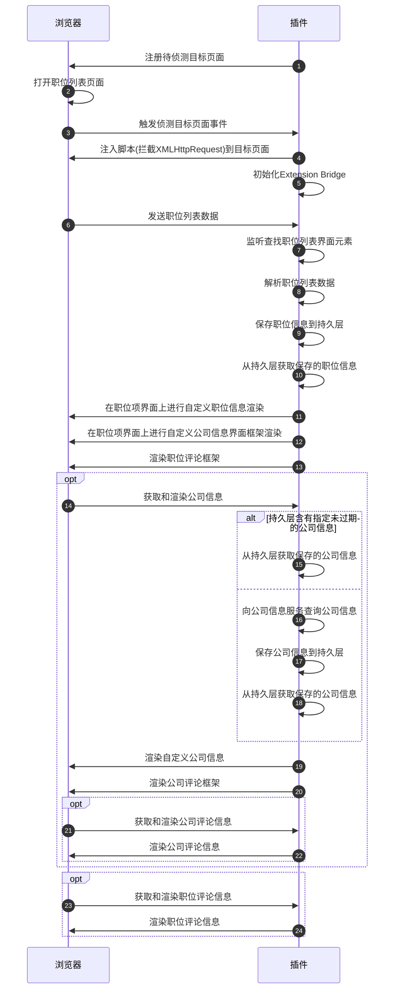
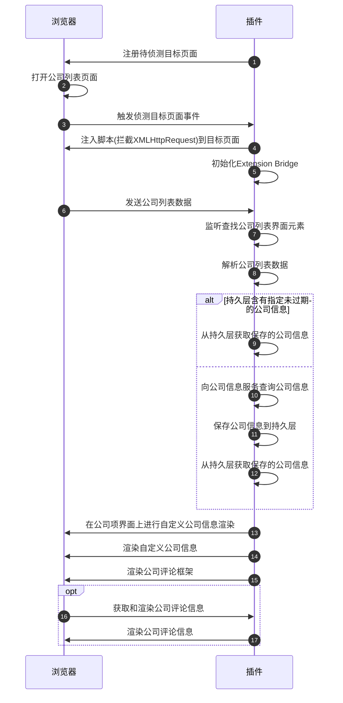

# 核心逻辑

## 从网站获取数据和渲染额外信息

### 职位数据



### 公司数据



## 自定义职位卡片渲染

```text
┌────────────────────────────────────────────────────────────────┐
│                                                  │ 职位额外信息│
│────────────────────────────────────────────────────────────────│
│                     职位信息                                   │
│                                                                │
│────────────────────────────────────────────────────────────────│
│                     公司信息                                   │
│                                                                │
│                                                                │
│                                                                │
│────────────────────────────────────────────────────────────────│
│ 公司风评检测                                                   │
│────────────────────────────────────────────────────────────────│
│ 公司标签                                                       │
│────────────────────────────────────────────────────────────────│
│                                  其他渠道 公司评论 在线公司评论│
│────────────────────────────────────────────────────────────────│
│ 职位标签                                                       │
│────────────────────────────────────────────────────────────────│
│ 职位浏览统计===                                        职位评论│
└────────────────────────────────────────────────────────────────┘
```

1. 监听职位列表元素
   ▲

   | 平台                     | 职位列表元素定位      | 备注 |
   | ------------------------ | --------------------- | ---- |
   | 前程无忧                 | .joblist              |      |
   | BOSS 直聘                | .rec-job-list         |      |
   | 猎聘网                   | .job-list-box         |      |
   | 智联招聘                 | .positionlist\_\_list |      |
   | 拉勾网                   | .list\_\_YibNq        |      |
   | 就业在线                 | .position-wrap        |      |
   | 广东公共求职招聘服务平台 | .ant-list-items       |      |

1. 为职位列表容器设置 flex 布局(使得在不改变 dom 结构的情况下，通过设置 css 的 order 属性来达到改变职位项前后位置)
1. 渲染`加载中`元素
1. 渲染职位额外信息
   1. 进行年龄限制的检测渲染
   1. 对职位时间进行处理渲染（初见时间/发布时间）
   1. Hr 活跃时间渲染
   1. 职位的公司信息（外包/培训机构）渲染
   1. 对职位时间进行染色
   1. 职位分析检测和渲染
1. 隐藏`加载中`元素
1. 修改职位卡片 css 的 order 属性，对职位卡片进行排序
1. 渲染底部功能栏
   1. 渲染 logo
   1. 公司信息渲染
      1. 查询公司信息按钮渲染
      1. 对公司名处理
      1. 公司详情渲染
      1. 公司标签渲染(其他人/我)
      1. 公司风评渲染
      1. 其他途径查询弹窗渲染
      1. 在线公司评论按钮渲染
   1. 职位标签渲染(其他人/我)
   1. 职位查看和展示次数渲染
1. 最终渲染
   1. 职位评论按钮渲染
   1. 职位卡片渲染完成标识

## 内部 API 调用

## 内嵌数据库

### SQL API

### Schema Changes

### 备份

## 内部任务系统

## 数据同步

## 数据导入与导出

## Oauth

## BBS 系统

## 自动化

## LLM
