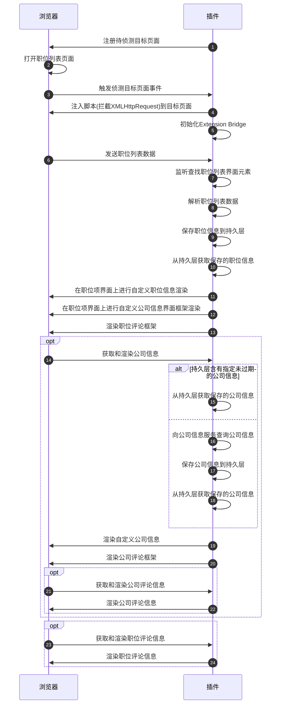
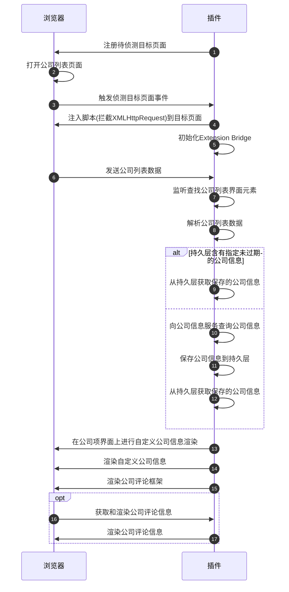
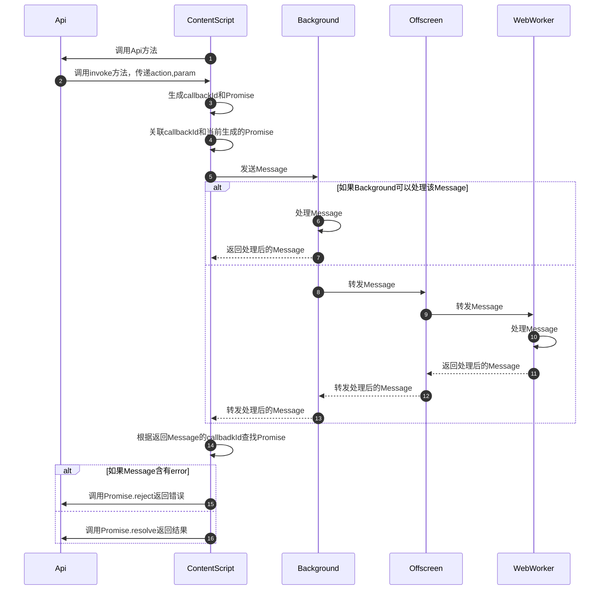
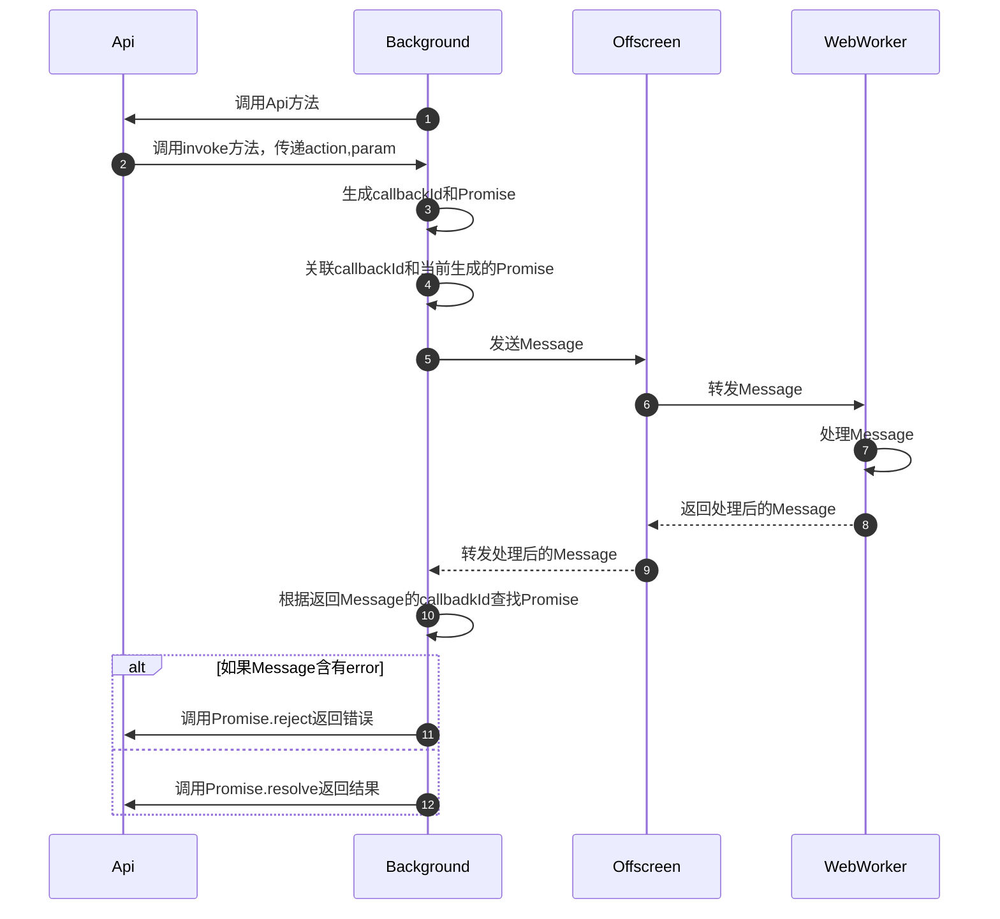
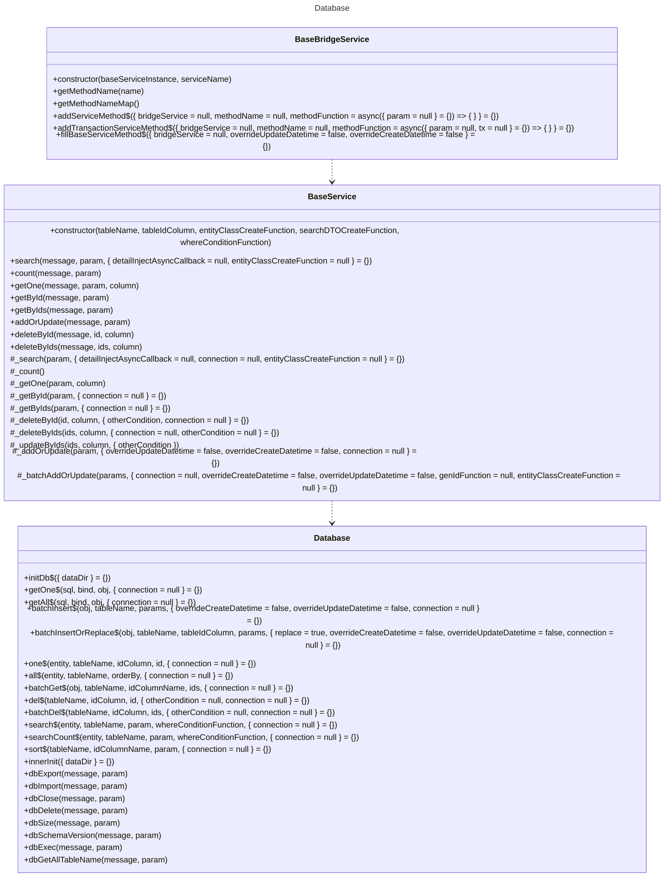
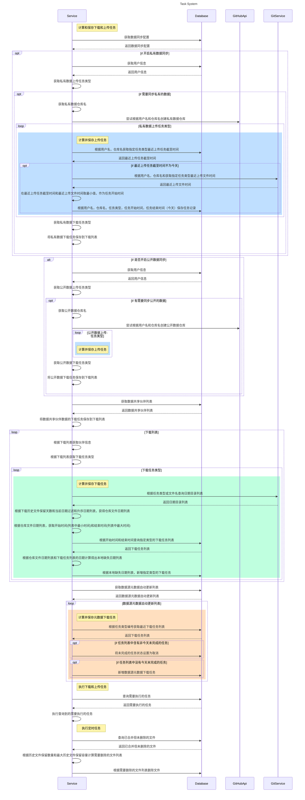
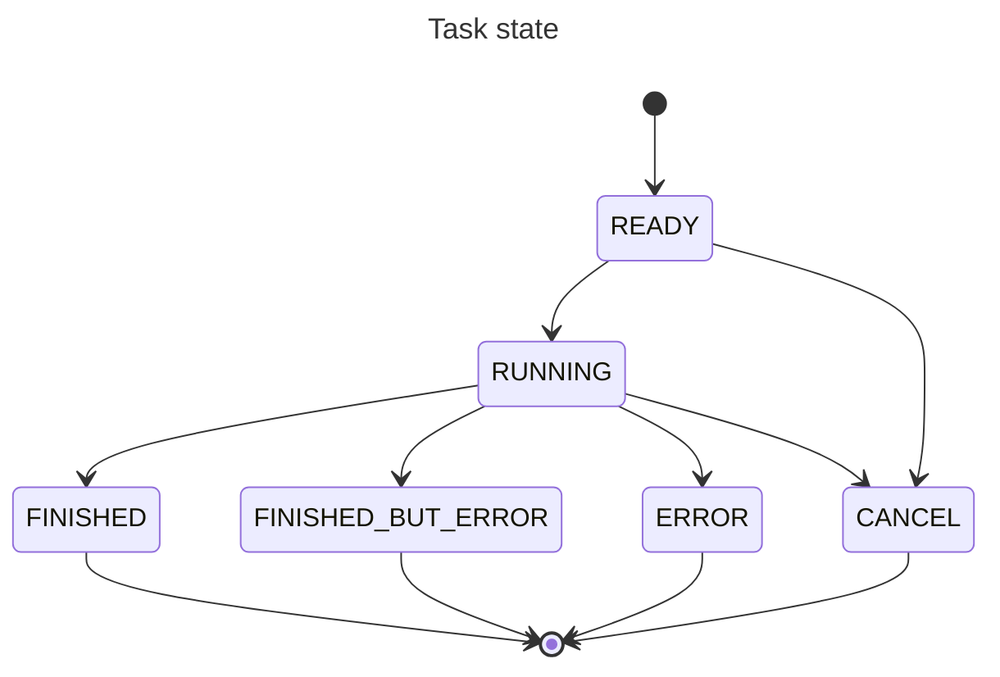
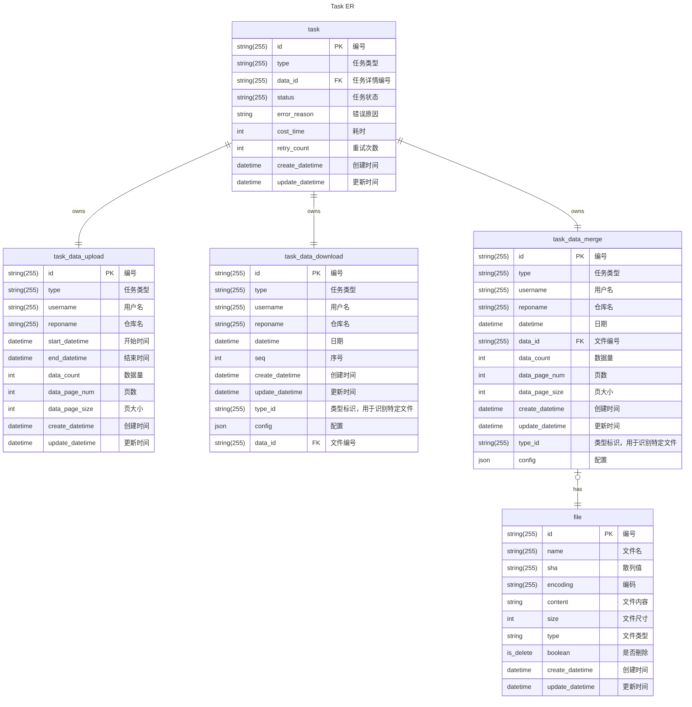
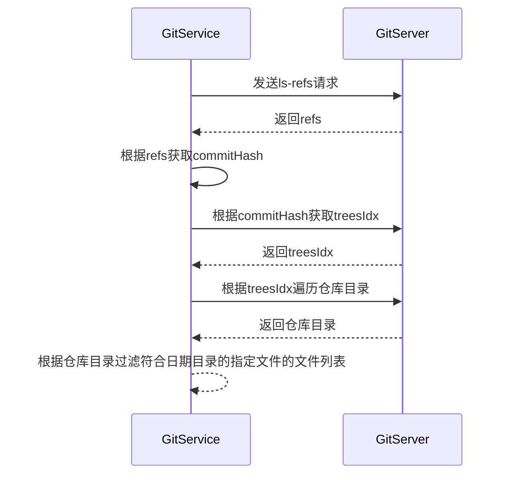
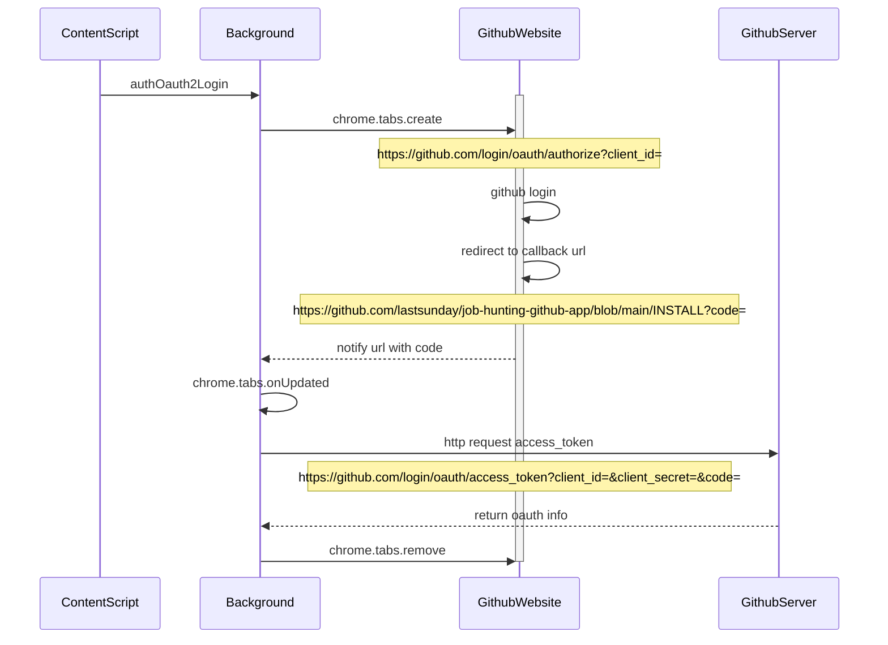

# 核心逻辑

## 从网站获取数据和渲染额外信息

### 职位数据



### 公司数据



## 自定义职位卡片渲染

```text
┌────────────────────────────────────────────────────────────────┐
│                                                │ Job extra info│
│────────────────────────────────────────────────────────────────│
│                     Job info                                   │
│                                                                │
│────────────────────────────────────────────────────────────────│
│                     Company info                               │
│                                                                │
│                                                                │
│                                                                │
│────────────────────────────────────────────────────────────────│
│ Company evaluation checking                                    │
│────────────────────────────────────────────────────────────────│
│ Company tag                                                    │
│────────────────────────────────────────────────────────────────│
│                   Othre|Company comment| Online company comment│
│────────────────────────────────────────────────────────────────│
│ Job tag                                                        │
│────────────────────────────────────────────────────────────────│
│ Job browse statistics ===                           Job Comment│
└────────────────────────────────────────────────────────────────┘
```

1. 监听职位列表元素
   ▲

   | 平台                     | 职位列表元素定位      | 备注 |
   | ------------------------ | --------------------- | ---- |
   | 前程无忧                 | .joblist              |      |
   | BOSS 直聘                | .rec-job-list         |      |
   | 猎聘网                   | .job-list-box         |      |
   | 智联招聘                 | .positionlist\_\_list |      |
   | 拉勾网                   | .list\_\_YibNq        |      |
   | 就业在线                 | .position-wrap        |      |
   | 广东公共求职招聘服务平台 | .ant-list-items       |      |

1. 为职位列表容器设置 flex 布局(使得在不改变 dom 结构的情况下，通过设置 css 的 order 属性来达到改变职位项前后位置)
1. 渲染`加载中`元素
1. 渲染职位额外信息
   1. 进行年龄限制的检测渲染
   1. 对职位时间进行处理渲染（初见时间/发布时间）
   1. Hr 活跃时间渲染
   1. 职位的公司信息（外包/培训机构）渲染
   1. 对职位时间进行染色
   1. 职位分析检测和渲染
1. 隐藏`加载中`元素
1. 修改职位卡片 css 的 order 属性，对职位卡片进行排序
1. 渲染底部功能栏
   1. 渲染 logo
   1. 公司信息渲染
      1. 查询公司信息按钮渲染
      1. 对公司名处理
      1. 公司详情渲染
      1. 公司标签渲染(其他人/我)
      1. 公司风评渲染
      1. 其他途径查询弹窗渲染
      1. 在线公司评论按钮渲染
   1. 职位标签渲染(其他人/我)
   1. 职位查看和展示次数渲染
1. 最终渲染
   1. 职位评论按钮渲染
   1. 职位卡片渲染完成标识

## 内部 API

### 内部 API 注册与使用

#### 1. Service 注册(worker.js)

```js
const ACTION_FUNCTION = new Map();

export const WorkerBridge = {
  ping: function (message, param) {
    postSuccessMessage(message, 'pong');
  },
};

const { mergeServiceMethod } = useService();

mergeServiceMethod(ACTION_FUNCTION, WorkerBridge);
mergeServiceMethod(ACTION_FUNCTION, DataSourceMetadataService);
```

#### 2. API 注册(api/index.js)

```js
export const DataSourceMetadataApi = {
  dataSourceMetadataSearch: mockFunction,
  dataSourceMetadataAddOrUpdate: mockFunction,
  dataSourceMetadataBatchAddOrUpdate: mockFunction,
  dataSourceMetadataGetById: mockFunction,
  dataSourceMetadataGetByIds: mockFunction,
  dataSourceMetadataDeleteById: mockFunction,
  dataSourceMetadataDeleteByIds: mockFunction,
};
fillBridgeApi({ api: DataSourceMetadataApi });
```

#### 3. API 使用

> [!IMPORTANT]
> 通过 API 方法来调用 Service 方法

```js
const param = new DataSourceMetadataSearchBO();
param.enable = true;
param.orderByColumn = 'seq';
param.orderBy = 'ASC';
const result = await DataSourceMetadataApi.dataSourceMetadataSearch(param);
```

#### 约束

1. 方法名约定： ClassName+MethodName，如 DataSourceMetadataApi
   - ClassName: DataSourceMetadata
   - MethodName: Search
   - 结果为: dataSourceMetadataSearch
1. 方法传入参数类型约定: JSONObject 或其他基本数据类型
1. 方法都为 async function

#### 原理

- 利用 JSONObject 的 keys,value 进行 Service 方法的绑定

```js
const fillBridgeApi = ({ api = {} } = {}) => {
  const keys = Object.keys(api);
  keys.forEach((invokeName) => {
    api[invokeName] = async (param) => {
      const result = await invoke(invokeName, param);
      return result.data;
    };
  });
  return api;
};
```

- 手动声明进行 Service 方法绑定

```js
export const JobSnapshotApi = {
  jobSnapshotDeleteByIds: async function (param) {
    const result = await invoke(this.jobSnapshotDeleteByIds.name, param);
    return result.data;
  },
};
```

- 利用方法名来定位 Service 和 Service 方法: className+MethodName

### 内部 API 调用原理

> [!IMPORTANT]
> action = className+MethodName

#### 从 ContentScript 调用



#### 从 Background 调用



#### 从 WebWorker 调用

> [!IMPORTANT]
>
> - Webworker 发起的 Api 调用不会经过 ContentScript,Background,Offscreen 这些模块的处理流程
> - 调用的方法仅限于 Github Api (仅执行网络访问)

#### 对大 Message 传递的处理

> [!IMPORTANT]
>
> <https://github.com/lastsunday/job-hunting/commit/ae0cee1>

## 内嵌数据库

### SQL Class



#### Service 实现

```js
import { DataSourceMetadataSearchBO } from '@/common/data/bo/dataSourceMetadataSearchBO';
import { DataSourceMetadata } from '@/common/data/domain/dataSourceMetadata';
import BaseBridgeService, { fillBaseServiceMethod } from './baseBridgeService';
import { BaseService } from './baseService';
import {
  genEqValueConditionSql,
  genInTextSql,
  genLikeSql,
  genRangeDatetimeConditionSql,
} from './sqlUtil';
const TABLE_NAME = 'data_source_metadata';
const TABLE_ID_COLUMN = 'id';
const SERVICE_NAME = 'dataSourceMetadata';
export const SERVICE_INSTANCE = new BaseService(
  TABLE_NAME,
  TABLE_ID_COLUMN,
  () => {
    return new DataSourceMetadata();
  },
  () => {
    return new DataSourceMetadataSearchBO();
  },
  (param) => {
    let whereCondition = ''.concat(
      genInTextSql(param.id, 'id'),
      genLikeSql(param.name, 'name'),
      genEqValueConditionSql(param.enable, 'enable'),
      genInTextSql(param.type, 'type'),
      genEqValueConditionSql(param.autoUpdateEnable, 'auto_update_enable'),
      genRangeDatetimeConditionSql(
        param.startDatetimeForCreate,
        param.endDatetimeForCreate,
        'create_datetime'
      ),
      genRangeDatetimeConditionSql(
        param.startDatetimeForUpdate,
        param.endDatetimeForUpdate,
        'update_datetime'
      )
    );
    return whereCondition;
  }
);
const DataSourceMetadataService = new BaseBridgeService(
  SERVICE_INSTANCE,
  SERVICE_NAME
);
fillBaseServiceMethod({
  bridgeService: DataSourceMetadataService,
  overrideCreateDatetime: true,
  overrideUpdateDatetime: true,
});

export default DataSourceMetadataService;
```

#### ORM 机制

1. 例子

```js
const company = new Company();
await CompanyApi.addOrUpdateCompany(company);

//companyService
const SERVICE_INSTANCE = new BaseService(
  'company',
  'company_id',
  () => {
    return new Company();
  },
  () => {
    return new SearchCompanyDTO();
  },
  null
);

export const CompanyService = {
  addOrUpdateCompany: async function (message, param) {
    try {
      await SERVICE_INSTANCE._batchAddOrUpdate([param]);
      postSuccessMessage(message, {});
    } catch (e) {
      postErrorMessage(
        message,
        '[worker] addOrUpdateCompany error : ' + e.message
      );
    }
  },
};
```

1. 当前实现的特性

   1. 根据 JSONObject 进行 SQL 查询，新增，更新，删除

1. 底层原理

   1. 利用 JSONObject 的 keys,value 来识别列名，字段类型和内容。通过此来进行 SQL 的生成和返回结果 JSONObject 的生成
   1. JSONObject 属性名采用小驼峰命名法（lowerCamelCase）
   1. 表字段名采用下划线命名法（Snake Case）
   1. SQL 插入字段的值位置采用下标定位的方式，如$1
   1. 分页采用 LIMIT,OFFSET

### Schema Changes

```js
const changelogList = getChangeLogList();
let oldVersion = 0;
const newVersion = changelogList.length;
try {
  await db.transaction(async (tx) => {
    const SQL_CREATE_TABLE_VERSION = `
          CREATE TABLE IF NOT EXISTS version(
          num INTEGER
        )
      `;
    await tx.exec(SQL_CREATE_TABLE_VERSION);
    const SQL_QUERY_VERSION = 'SELECT num FROM version';
    const result = await tx.query(SQL_QUERY_VERSION);
    const rows = result.rows;
    if (rows.length > 0) {
      oldVersion = rows[0].num;
    } else {
      const SQL_INSERT_VERSION = `INSERT INTO version(num) values($1)`;
      await tx.query(SQL_INSERT_VERSION, [0]);
    }
    infoLog(
      '[DB] schema oldVersion = ' + oldVersion + ', newVersion = ' + newVersion
    );
    if (newVersion > oldVersion) {
      infoLog('[DB] schema upgrade start');
      for (let i = oldVersion; i < newVersion; i++) {
        const currentVersion = i + 1;
        const changelog = changelogList[i];
        const sqlList = changelog.getSqlList();
        infoLog(
          '[DB] schema upgrade changelog version = ' +
            currentVersion +
            ', sql total = ' +
            sqlList.length
        );
        for (let seq = 0; seq < sqlList.length; seq++) {
          infoLog(
            '[DB] schema upgrade changelog version = ' +
              currentVersion +
              ', execute sql = ' +
              (seq + 1) +
              '/' +
              sqlList.length
          );
          const sql = sqlList[seq];
          await tx.exec(sql);
        }
      }
      const SQL_UPDATE_VERSION = `UPDATE version SET num = $1`;
      await tx.query(SQL_UPDATE_VERSION, [newVersion]);
      infoLog('[DB] schema upgrade finish to version = ' + newVersion);
      infoLog('[DB] current schema version = ' + newVersion);
    } else {
      infoLog('[DB] skip schema upgrade');
      infoLog('[DB] current schema version = ' + oldVersion);
    }
  });
} catch (e) {
  errorLog('[DB] schema upgrade fail,' + e.message);
}
```

1. ChangeLog 文件

   1. 文件格式: ChangeLog+V+版本号 = ChangeLogVxxx.js
   1. 例子

      ```js
      export class ChangeLogV1 extends ChangeLog {
        getSqlList() {
          let sqlList = [
            SQL_CREATE_TABLE_JOB,
            SQL_CREATE_TABLE_JOB_BROWSE_HISTORY,
          ];
          return sqlList;
        }
      }
      ```

1. ChangeLog 执行规则
   1. 将需要执行的 ChangeLog 存放到列表中
   1. 开启事务，以确保 ChangeLog 的执行的原子性
   1. 通过计算 ChangeLog 列表的总数与当前数据库版本号（版本号为上一次执行 ChangLog 的数量）进行对比计算，来获取当前需要执行的 ChangeLog
   1. 执行完成后，更新数据库版本号（版本号即为已执行 ChangeLog 的数量）

### 备份

> [!IMPORTANT]
> 当前使用 pglite dump 备份大量数据的数据库会出错

TODO

## 内部任务系统



### 任务状态图



### 数据关系图



### 任务类型

```js
export const TASK_TYPE_JOB_DATA_UPLOAD = 'JOB_DATA_UPLOAD';
export const TASK_TYPE_JOB_DATA_DOWNLOAD = 'JOB_DATA_DOWNLOAD';
export const TASK_TYPE_JOB_DATA_MERGE = 'JOB_DATA_MERGE';

export const TASK_TYPE_COMPANY_DATA_UPLOAD = 'COMPANY_DATA_UPLOAD';
export const TASK_TYPE_COMPANY_DATA_DOWNLOAD = 'COMPANY_DATA_DOWNLOAD';
export const TASK_TYPE_COMPANY_DATA_MERGE = 'COMPANY_DATA_MERGE';

export const TASK_TYPE_COMPANY_TAG_DATA_UPLOAD = 'COMPANY_TAG_DATA_UPLOAD';
export const TASK_TYPE_COMPANY_TAG_DATA_DOWNLOAD = 'COMPANY_TAG_DATA_DOWNLOAD';
export const TASK_TYPE_COMPANY_TAG_DATA_MERGE = 'COMPANY_TAG_DATA_MERGE';

export const TASK_TYPE_JOB_TAG_DATA_UPLOAD = 'JOB_TAG_DATA_UPLOAD';
export const TASK_TYPE_JOB_TAG_DATA_DOWNLOAD = 'JOB_TAG_DATA_DOWNLOAD';
export const TASK_TYPE_JOB_TAG_DATA_MERGE = 'JOB_TAG_DATA_MERGE';

export const TASK_TYPE_JOB_PUBLIC_DATA_UPLOAD = 'JOB_PUBLIC_DATA_UPLOAD';
export const TASK_TYPE_JOB_PUBLIC_DATA_DOWNLOAD = 'JOB_PUBLIC_DATA_DOWNLOAD';
export const TASK_TYPE_JOB_PUBLIC_DATA_MERGE = 'JOB_PUBLIC_DATA_MERGE';

export const TASK_TYPE_METADATA_DATA_DOWNLOAD = 'METADATA_DATA_DOWNLOAD';
export const TASK_TYPE_METADATA_DATA_MERGE = 'METADATA_DATA_MERGE';

export const TASK_TYPE_COMPANY_COMMENT_DATA_DOWNLOAD =
  'COMPANY_COMMENT_DATA_DOWNLOAD';
export const TASK_TYPE_COMPANY_COMMENT_DATA_MERGE =
  'COMPANY_COMMENT_DATA_MERGE';
```

## 数据同步

### 数据仓库文件结构

```txt
  ├── YYYY                              //年份，格式YYYY
  │   └── MM-DD                         //月日，格式MM-DD
  │       ├─── company.zip
  │       ├─── job.zip
  │       ├─── job_tag.zip
  │       ├─── company_tag.zip
```

### Git 读取数据仓库文件结构

> <https://git-scm.com/docs/gitprotocol-v2>



### 数据合并文件

1. 文件格式: excel
1. 文件内容格式

   | 字段名       | 字段类型 | 备注                                       |
   | ------------ | -------- | ------------------------------------------ |
   | 编号         | string   | 记录唯一标识                               |
   | xxx          | xxx      |                                            |
   | `__VERSION_` | int      | 版本号,如果该字段不存在，则会被认为第 0 版 |

1. 版本识别规则
   1. 通过版本号字段读取文件的文件字段列表
   1. 根据文件字段列表识别文件是否合法

### 数据递增规则

1. 以记录创建时间为数据增量规则
1. 各数据格式增量更新规则字段

   1. 职位

      1. `createDatetime`
      1. `updateDatetime`
      1. `isFullCompanyName`

   1. 职位公开数据

      1. `createDatetime`

   1. 职位快照

      1. `updateDatetime`

   1. 职位标签

      > 未正确实现覆盖更新

      1. `updateDatetime`

   1. 公司

      1. `sourceRefreshDatetime`

   1. 公司标签

      > 未正确实现覆盖更新

      1. `updateDatetime`

   1. 公司评论

      1. `createDatetime`

### 各数据类型版本

#### 职位

| 字段           | 类型     | 生效版本 | 格式                        |
| -------------- | -------- | -------- | --------------------------- |
| 职位自编号     | string   | 0        |                             |
| 发布平台       | string   | 0        |                             |
| 职位访问地址   | string   | 0        |                             |
| 职位           | string   | 0        |                             |
| 公司           | string   | 0        |                             |
| 公司是否为全称 | bool     | 0        |                             |
| 地区           | string   | 0        |                             |
| 地址           | string   | 0        |                             |
| 经度           | number   | 0        |                             |
| 纬度           | number   | 0        |                             |
| 职位描述       | string   | 0        |                             |
| 学历           | string   | 0        |                             |
| 所需经验       | string   | 0        |                             |
| 技能           | string   | 1        |                             |
| 福利           | string   | 1        |                             |
| 最低薪资       | number   | 0        |                             |
| 最高薪资       | number   | 0        |                             |
| 首次发布时间   | datetime | 0        | rfc3339/yyyy-MM-dd HH:mm:ss |
| 招聘人         | string   | 0        |                             |
| 招聘公司       | string   | 0        |                             |
| 招聘者职位     | string   | 0        |                             |
| 首次扫描日期   | datetime | 0        | rfc3339/yyyy-MM-dd HH:mm:ss |
| 记录更新日期   | datetime | 0        | rfc3339/yyyy-MM-dd HH:mm:ss |

#### 职位标签

| 字段         | 类型     | 生效版本 | 格式                        |
| ------------ | -------- | -------- | --------------------------- |
| 职位编号     | string   | 0        |                             |
| 标签         | string   | 0        |                             |
| 记录更新日期 | datetime | 1        | rfc3339/yyyy-MM-dd HH:mm:ss |

#### 职位公开数据

| 字段         | 类型     | 生效版本 | 格式                        |
| ------------ | -------- | -------- | --------------------------- |
| 职位自编号   | string   | 0        |                             |
| 首次扫描日期 | datetime | 0        | rfc3339/yyyy-MM-dd HH:mm:ss |
| 记录更新日期 | datetime | 0        | rfc3339/yyyy-MM-dd HH:mm:ss |

#### 职位快照

| 字段     | 类型     | 生效版本 | 格式                        |
| -------- | -------- | -------- | --------------------------- |
| 编号     | string   | 0        |                             |
| 职位编号 | string   | 0        |                             |
| 职位链接 | string   | 0        |                             |
| 内容     | string   | 0        |                             |
| 招聘平台 | string   | 0        |                             |
| 创建日期 | datetime | 0        | rfc3339/yyyy-MM-dd HH:mm:ss |
| 更新日期 | datetime | 0        | rfc3339/yyyy-MM-dd HH:mm:ss |

#### 公司

| 字段             | 类型     | 生效版本 | 格式                        |
| ---------------- | -------- | -------- | --------------------------- |
| 公司             | string   | 0        |                             |
| 公司描述         | string   | 0        |                             |
| 成立时间         | string   | 0        |                             |
| 经营状态         | string   | 0        |                             |
| 法人             | string   | 0        |                             |
| 统一社会信用代码 | string   | 0        |                             |
| 官网             | string   | 0        |                             |
| 社保人数         | number   | 0        |                             |
| 自身风险数       | number   | 0        |                             |
| 关联风险数       | number   | 0        |                             |
| 地址             | string   | 0        |                             |
| 经营范围         | string   | 0        |                             |
| 纳税人识别号     | string   | 0        |                             |
| 所属行业         | string   | 0        |                             |
| 工商注册号       | string   | 0        |                             |
| 经度             | number   | 0        |                             |
| 纬度             | number   | 0        |                             |
| 注册资本         | string   | 2        |                             |
| 注册资本货币     | string   | 2        |                             |
| 数据来源地址     | string   | 0        |                             |
| 数据来源平台     | string   | 0        |                             |
| 数据来源记录编号 | string   | 0        |                             |
| 数据来源更新时间 | datetime | 0        | rfc3339/yyyy-MM-dd HH:mm:ss |
| 记录创建日期     | datetime | 1        | rfc3339/yyyy-MM-dd HH:mm:ss |
| 记录更新日期     | datetime | 1        | rfc3339/yyyy-MM-dd HH:mm:ss |

#### 公司标签

| 字段         | 类型     | 生效版本 | 格式                        |
| ------------ | -------- | -------- | --------------------------- |
| 公司         | string   | 0        |                             |
| 标签         | string   | 0        |                             |
| 记录更新日期 | datetime | 1        | rfc3339/yyyy-MM-dd HH:mm:ss |

#### 公司评论

| 字段     | 类型     | 生效版本 | 格式                        |
| -------- | -------- | -------- | --------------------------- |
| 公司     | string   | 0        |                             |
| 评论     | string   | 0        |                             |
| 情感     | string   | 1        |                             |
| 数据集   | string   | 1        |                             |
| 创建日期 | datetime | 1        | rfc3339/yyyy-MM-dd HH:mm:ss |
| 更新日期 | datetime | 1        | rfc3339/yyyy-MM-dd HH:mm:ss |

## 数据导入与导出

> [!IMPORTANT]
> 数据导入逻辑与数据同步逻辑一样

1. 数据拆分导出

## Oauth

### Github Oauth2 流程



## BBS 系统

1. 采用 Github Issues 作为服务端
1. 地区选择实现原理

   1. 利用标题作为搜索字段
   1. targetId = sha256 地区名: sha256(省)-sha256(市)-sha256(区)

      ```hql
         search(query:"${targetId} in:title sort:created-desc is:issue is:open repo:${GITHUB_APP_REPO}", type: ISSUE, first: ${first ?? null}, after: ${after ? "\"" + after + "\"" : null},last:${last ?? null},before:${before ? "\"" + before + "\"" : null})
      ```

1. 使用的 Github API
   1. HQL 查询(可查询 Issues): <https://api.github.com/graphql>
   1. 新增 Issues: POST <https://api.github.com/repos/lastsunday/job-hunting-github-app/issues>
   1. 查询 Issues Comment: GET <https://api.github.com/repos/lastsunday/job-hunting-github-app/issues/${issueNumber}/comments?per_page=${pageSize}&page=${pageNum}>
   1. 新增 Issues Comment: POST <https://api.github.com/repos/lastsunday/job-hunting-github-app/issues/${issueNumber}/comments>

## 自动化

1. 采用 puppeteer 类库在 debug 模式下运行
1. 当前用于自动浏览职位页面

## LLM

1. 外部 LLM

   1. ollama

      <https://docs.ollama.com/api/introduction>

   1. openai

      <https://platform.openai.com/docs/api-reference/chat>

   1. siliconflow

      <https://docs.siliconflow.com/en/api-reference/chat-completions/chat-completions>

1. 内嵌 LLM

   1. web-llm

      <https://github.com/mlc-ai/web-llm>
