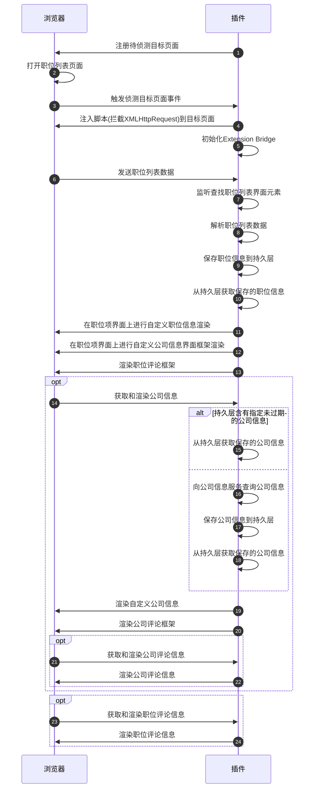
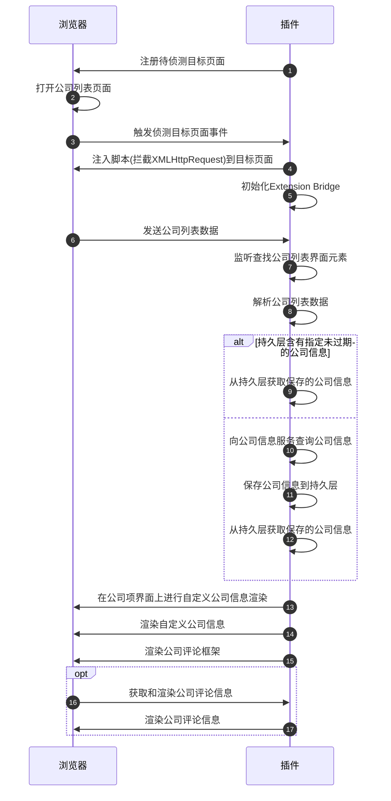

# 核心逻辑

## 从网站获取数据

### 职位数据

```mermaid
sequenceDiagram
  participant browser as 浏览器
  participant extension as 插件
  autonumber
  extension ->> browser: 注册待侦测目标页面
  browser ->> browser: 打开职位列表页面
  browser ->> extension: 触发侦测目标页面事件
  extension ->> browser: 注入脚本(拦截XMLHttpRequest)到目标页面
  extension ->> extension: 初始化Extension Bridge
  browser ->> extension: 发送职位列表数据
  extension ->> extension: 监听查找职位列表界面元素
  extension ->> extension: 解析职位列表数据
  extension ->> extension: 保存职位信息到持久层
  extension ->> extension: 从持久层获取保存的职位信息
  extension ->> browser: 在职位项界面上进行自定义职位信息渲染
  extension ->> browser: 在职位项界面上进行自定义公司信息界面框架渲染
  extension ->> browser: 渲染职位评论框架
  opt
    browser ->> extension: 获取和渲染公司信息
    alt 持久层含有指定未过期的公司信息
      extension ->> extension: 从持久层获取保存的公司信息
    else
      extension ->> extension: 向公司信息服务查询公司信息
      extension ->> extension: 保存公司信息到持久层
      extension ->> extension: 从持久层获取保存的公司信息
    end
    extension ->> browser: 渲染自定义公司信息
    extension ->> browser: 渲染公司评论框架
    opt
      browser ->> extension: 获取和渲染公司评论信息
      extension ->> browser: 渲染公司评论信息
    end
  end
  opt
    browser ->> extension: 获取和渲染职位评论信息
    extension ->> browser: 渲染职位评论信息
  end
```

### 公司数据

```mermaid
sequenceDiagram
  participant browser as 浏览器
  participant extension as 插件
  autonumber
  extension ->> browser: 注册待侦测目标页面
  browser ->> browser: 打开公司列表页面
  browser ->> extension: 触发侦测目标页面事件
  extension ->> browser: 注入脚本(拦截XMLHttpRequest)到目标页面
  extension ->> extension: 初始化Extension Bridge
  browser ->> extension: 发送公司列表数据
  extension ->> extension: 监听查找公司列表界面元素
  extension ->> extension: 解析公司列表数据
  alt 持久层含有指定未过期的公司信息
    extension ->> extension: 从持久层获取保存的公司信息
  else
    extension ->> extension: 向公司信息服务查询公司信息
    extension ->> extension: 保存公司信息到持久层
    extension ->> extension: 从持久层获取保存的公司信息
  end
  extension ->> browser: 在公司项界面上进行自定义公司信息渲染
  extension ->> browser: 渲染自定义公司信息
  extension ->> browser: 渲染公司评论框架
  opt
    browser ->> extension: 获取和渲染公司评论信息
    extension ->> browser: 渲染公司评论信息
  end
```

## 自定义职位卡片渲染

## 内部 API 调用

## 内嵌数据库

### SQL API

### Schema Changes

### 备份

## 内部任务系统

## 数据同步

## 数据导入与导出

## Oauth

## BBS 系统

## 自动化

## LLM
