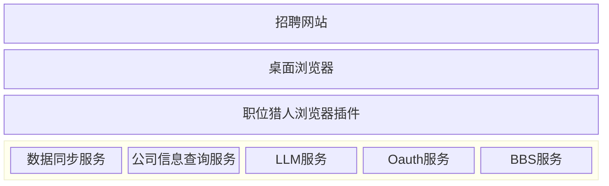

# 深入开发

## 架构



1. 招聘网站
   - 支持桌面版的招聘网站版面
   - 提供职位信息列表
1. 桌面浏览器
   - Chrome,Edge
1. 职位猎人浏览器插件
1. 外部服务

   1. 数据同步服务

      ```text
      Git
      ```

      - 基础信息
        - 职位信息
        - 公司信息
        - 职位标签
        - 公司标签
      - 数据源

   1. 公司信息查询服务
      - 基础信息
      - 风评
   1. 公司评论查询服务
   1. LLM 服务

      ```text
      内嵌 LLM(Web llm)，远程 LLM
      ```

      - 职位分析

   1. Oauth 服务

      ```text
      Github Oauth2
      ```

   1. BBS 服务

      ```text
      Github Issues API
      ```

      - 讨论区
      - 评论(职位，公司)

## 职位猎人浏览器插件

### 职位展示页面

1. 数据获取
   - 职位
   - 公司
1. 数据持久化
1. 自定义职位卡片信息
   - 职位发布/初见时间
   - 公司特性检测(外包,培训机构等...)
   - 年龄限制检测
   - 职位浏览/展示次数
   - 职位匹配度
   - HR 活跃状态
   - 标签
     - 职位
     - 公司
   - 评论
     - 职位
     - 公司
   - 公司风评检测
   - 公司官网
     - 可达性检测
     - 备案信息检测

### 后台管理

1. 职位搜索
   - 列表
   - 地图
1. 职位浏览历史
1. 职位详情快照
1. 讨论区
1. 数据
   - 职位
   - 公司
   - 标签
   - 职位标签
   - 公司标签
   - 公司评论
1. 数据源
   - 列表
   - 元数据
1. 任务
   - 统计
   - 详情
1. 系统
   - 设置
     - 数据备份
   - 数据管理
     - 数据导入
     - 数据导出
   - 数据库
     - 概况
     - 调试
   - 文件
