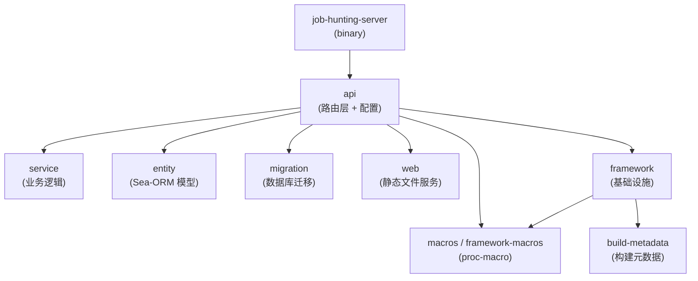

# 服务器端

服务器端是一个基于 [Axum](https://crates.io/crates/axum) 的 Rust Web 服务，提供 REST API 和后台任务调度能力。

## 核心功能

- **REST API**: 职位/公司数据 CRUD、搜索、分页排序
- **认证授权**: JWT（access token + refresh token，HS256）
- **OpenAPI 文档**: 基于 utoipa + Scalar UI，访问 `/docs`
- **数据同步**: 定时从远程仓库拉取数据，解析并合并入库
- **任务调度**: 基于 cron 表达式的任务计划系统，支持失败重试
- **静态文件服务**: 内嵌管理后台 SPA（`server-ui`）

## Crate 结构

| Crate | 说明 |
|-------|------|
| `job-hunting-server` | 二进制入口：CLI 解析、Tokio runtime、日志、信号处理 |
| `api` | REST API 路由定义、路由组装、配置结构体、`AppState` |
| `service` | 业务逻辑层：任务调度、数据同步、文件解析、Git 操作 |
| `entity` | Sea-ORM 实体模型（自动生成 + 手动补充） |
| `migration` | Sea-ORM 数据库迁移脚本 |
| `web` | 使用 `rust-embed` 内嵌 `server-ui` 前端产物 |
| `framework` | 共享基础设施：认证、错误处理、数据提取器、数据库连接、中间件 |
| `macros` | proc-macro 工具（`#[error]` 错误码宏等） |

## 技术栈

- **Web 框架**: Axum 0.8
- **中间件**: tower-http（CORS、timeout、body limit、tracing、compression）
- **API 文档**: utoipa-axum + Scalar
- **ORM**: Sea-ORM（PostgreSQL / SQLite）
- **Auth**: jsonwebtoken（HS256）+ bcrypt
- **配置**: figment（TOML 文件 + 环境变量 + CLI 覆盖）
- **ID 生成**: xid
- **日志**: tracing + tracing-subscriber（支持 console、文件、flamegraph、tokio-console）
- **测试**: cucumber BDD + testcontainers
