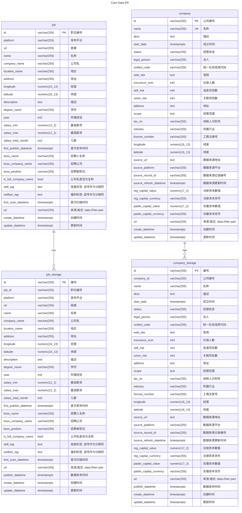
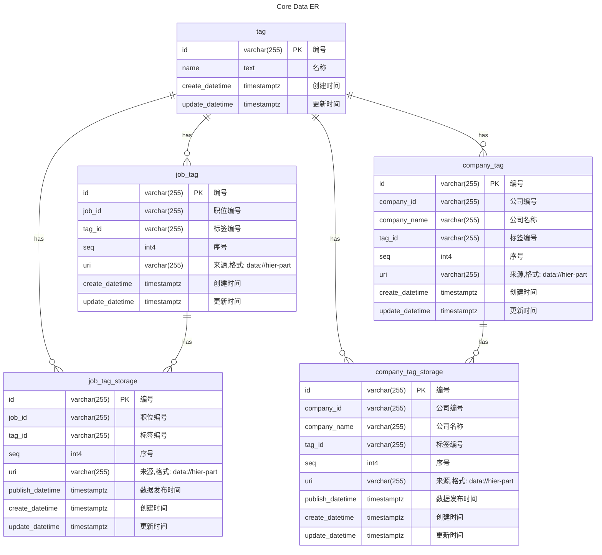
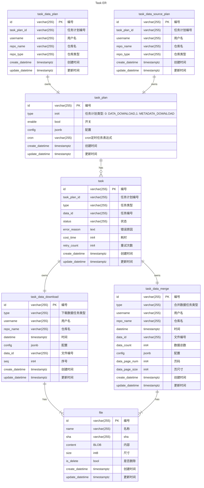
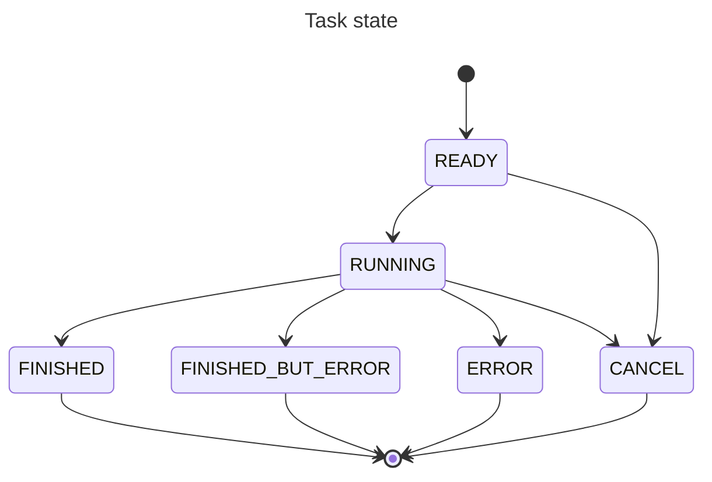

# 核心逻辑

> [!WIP]

## 数据结构与同步逻辑

数据同步流程以任务形式执行

流程：计算数据下载任务 -> 数据下载 -> 数据贮藏与合并

- 计算数据下载任务
  - (task_data_plan,task_data_source_plan)task_plan <-> task,task_data_download
- 数据下载
  - task,task_data_download <-> file,task,task_data_merge
- 数据贮藏与合并
  - task,task_data_merge <-> task,task_data_merge,job_storage,company_storage,job_tag_storage,company_tag_storage,job,company,job_tag,company_tag

### 核心数据关系图



#### URI

> <https://www.rfc-editor.org/rfc/rfc3986.html>

Example

```txt
 data:://[username[@]][host]/[path]
```

- data://lastsunday@github.com/lastsunday/job-hunting-data/blob/main/2026/03-03/job.zip
- data://lastsunday@github.com/lastsunday/job-hunting-data/blob/main/2024/12-20/company.zip
- data://lastsunday@aiqicha.baidu.com/company_detail_19146183042612
- data://admin@system

### 核心额外数据关系图



#### URI

Example

```txt
 data:://[username[@]][host]/[path]
```

- data://lastsunday@github.com/lastsunday/job-hunting-data/blob/main/2024/12-26/company_tag.zip
- data://lastsunday@github.com/lastsunday/job-hunting-data/blob/main/2026/03-03/job.zip
- data://system

### 任务关系图



#### task type

- JOB_DATA_DOWNLOAD
- JOB_DATA_MERGE
- COMPANY_DATA_DOWNLOAD
- COMPANY_DATA_MERGE
- COMPANY_TAG_DATA_DOWNLOAD
- COMPANY_TAG_DATA_MERGE
- JOB_TAG_DATA_DOWNLOAD
- JOB_TAG_DATA_MERGE
- JOB_PUBLIC_DATA_DOWNLOAD
- JOB_PUBLIC_DATA_MERGE
- METADATA_DATA_DOWNLOAD
- METADATA_DATA_MERGE
- COMPANY_COMMENT_DATA_DOWNLOAD
- COMPANY_COMMENT_DATA_MERGE

#### task status

- READY
- RUNNING
- CANCEL
- FINISHED
- FINISHED_BUT_ERROR
- ERROR


