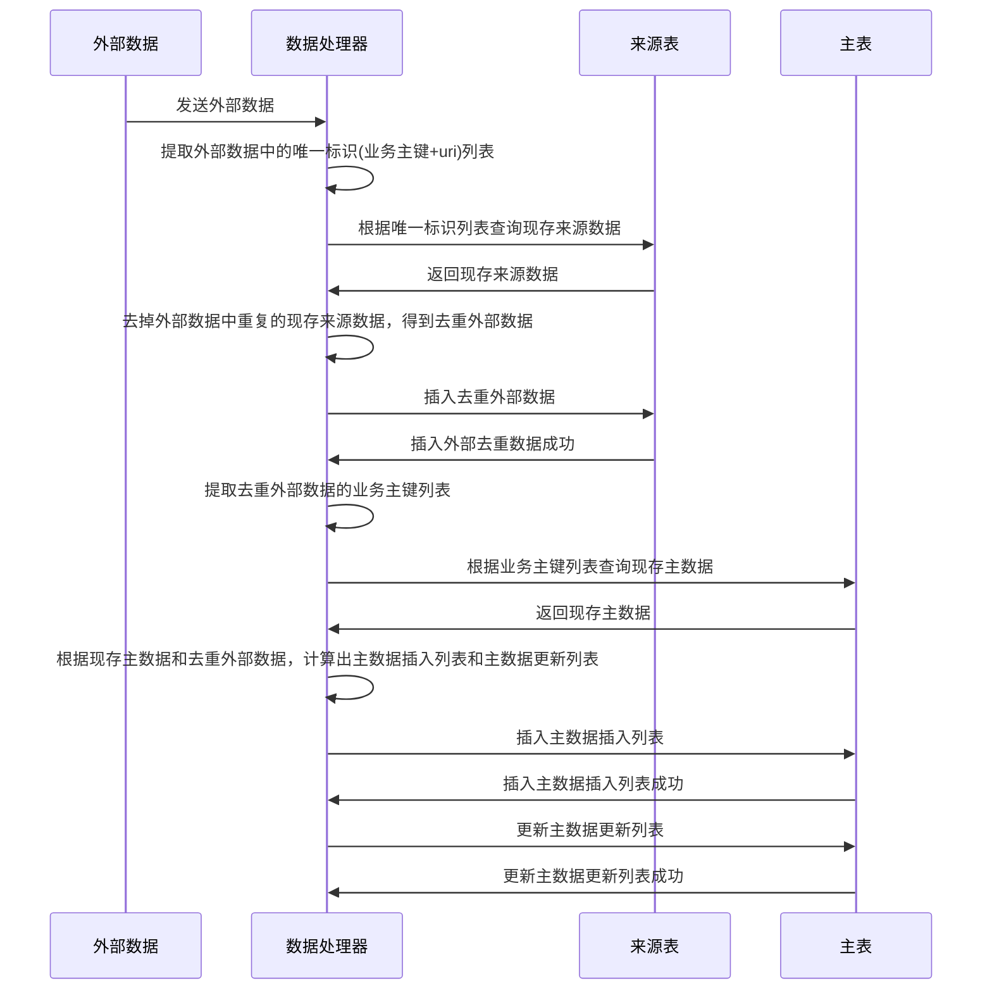
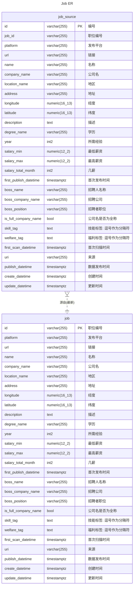
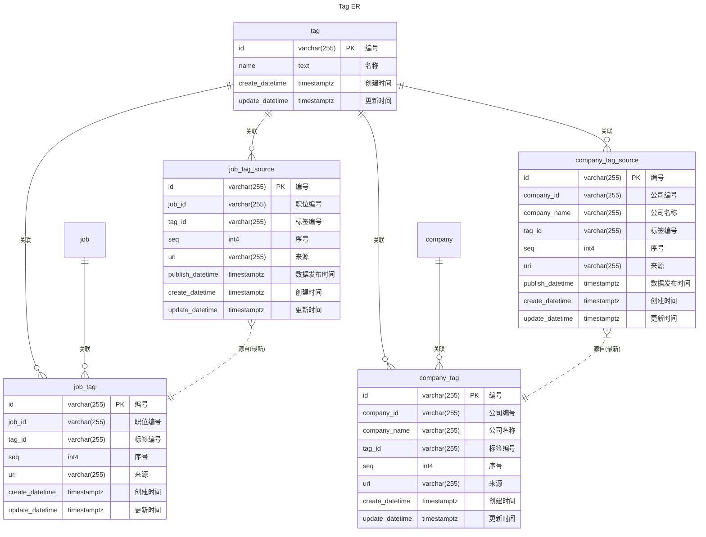
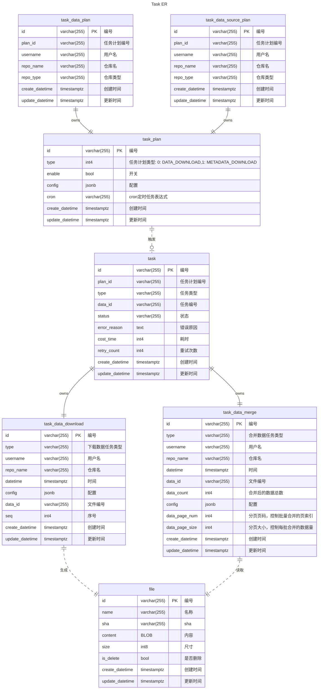
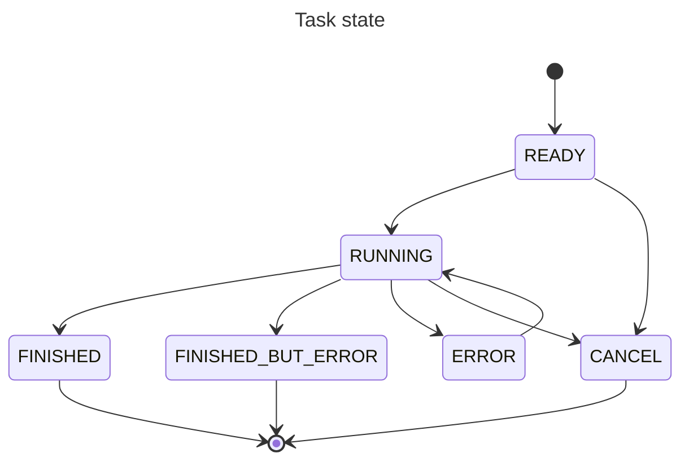

# 核心逻辑与数据结构设计

## 数据同步流程

> [!WIP]

数据同步流程以任务形式执行

流程：计算数据下载任务 -> 数据下载 -> 数据贮藏与合并

- 计算数据下载任务
  - (task_data_plan,task_data_source_plan)task_plan <-> task,task_data_download
- 数据下载
  - task,task_data_download <-> file,task,task_data_merge
- 数据贮藏与合并
  - task,task_data_merge <-> task,task_data_merge,job_source,company_source,job_tag_source,company_tag_source,job,company,job_tag,company_tag

### 数据合并



## 核心数据模型

#### URI 规范

> 参考：[RFC 3986](https://www.rfc-editor.org/rfc/rfc3986.html)

格式：`data://[username[@]]host/path`

字段说明：

- `username`：数据贡献者/上传者标识

示例：

```txt
data://lastsunday@github.com/lastsunday/job-hunting-data/blob/main/2026/03-03/job.zip
data://lastsunday@github.com/lastsunday/job-hunting-data/blob/main/2024/12-20/company.zip
data://lastsunday@aiqicha.baidu.com/company_detail_19146183042612
data://admin@system
```

### 职位相关表

> 设计说明：
>
> - `job_source`：多渠道原始数据来源表，存储来自不同用户/渠道的原始数据
> - `job`：标准化表，去重后的一手数据



### 公司相关表

> 设计说明：
>
> - `company_source`：多渠道原始数据来源表，存储来自不同用户/渠道的原始数据
> - `company`：标准化表，去重后的一手数据

```mermaid
---
title: Company ER
---
erDiagram
    company_source{
      id varchar(255) PK "编号"
      company_id varchar(255) "公司编号"
      name varchar(255) "名称"
      desc text "描述"
      start_date timestamptz "成立时间"
      status varchar(255) "经营状态"
      legal_person varchar(255) "法人"
      unified_code varchar(255) "统一社会信用代码"
      web_site text "官网"
      insurance_num int4 "社保人数"
      self_risk int4 "自身风险数"
      union_risk int4 "关联风险数"
      address text "地址"
      scope text "经营范围"
      tax_no varchar(255) "纳税人识别号"
      industry varchar(255) "所属行业"
      license_number varchar(255) "工商注册号"
      longitude numeric(16_13) "经度"
      latitude numeric(16_13) "纬度"
      source_url text "数据来源地址"
      source_platform varchar(255) "数据来源平台"
      source_record_id varchar(255) "数据来源记录编号"
      source_refresh_datetime timestamptz "数据来源更新时间"
      reg_capital_value numeric(17_2) "注册资本数值"
      reg_capital_currency varchar(255) "注册资本货币"
      paidin_capital_value numeric(17_2) "实缴资本数值"
      paidin_capital_currency varchar(255) "实缴资本货币"
      uri varchar(255) "来源"
      publish_datetime timestamptz "数据发布时间"
      create_datetime timestamptz "创建时间"
      update_datetime timestamptz "更新时间"
    }
    company_source }|..|| company : "源自(最新)"
    company{
      id varchar(255) PK "公司编号"
      name varchar(255) UK "名称"
      desc text "描述"
      start_date timestamptz "成立时间"
      status varchar(255) "经营状态"
      legal_person varchar(255) "法人"
      unified_code varchar(255) "统一社会信用代码"
      web_site text "官网"
      insurance_num int4 "社保人数"
      self_risk int4 "自身风险数"
      union_risk int4 "关联风险数"
      address text "地址"
      scope text "经营范围"
      tax_no varchar(255) "纳税人识别号"
      industry varchar(255) "所属行业"
      license_number varchar(255) "工商注册号"
      longitude numeric(16_13) "经度"
      latitude numeric(16_13) "纬度"
      source_url text "数据来源地址"
      source_platform varchar(255) "数据来源平台"
      source_record_id varchar(255) "数据来源记录编号"
      source_refresh_datetime timestamptz "数据来源更新时间"
      reg_capital_value numeric(17_2) "注册资本数值"
      reg_capital_currency varchar(255) "注册资本货币"
      paidin_capital_value numeric(17_2) "实缴资本数值"
      paidin_capital_currency varchar(255) "实缴资本货币"
      uri varchar(255) "来源"
      create_datetime timestamptz "创建时间"
      update_datetime timestamptz "更新时间"
    }
```



## 标签数据模型



## 任务系统设计

### 任务关系图

> 设计说明：
>
> - `task_data_plan` / `task_data_source_plan`：用于生成 `task_plan` 的配置表，便于从界面上描述任务计划，实际参与任务生成的是 `task_plan`



### 任务类型

- JOB_DATA_DOWNLOAD
- JOB_DATA_STORAGE_AND_MERGE
- COMPANY_DATA_DOWNLOAD
- COMPANY_DATA_STORAGE_AND_MERGE
- COMPANY_TAG_DATA_DOWNLOAD
- COMPANY_TAG_DATA_STORAGE_AND_MERGE
- JOB_TAG_DATA_DOWNLOAD
- JOB_TAG_DATA_STORAGE_AND_MERGE

### 任务状态

状态值：

- READY：等待执行
- RUNNING：执行中
- CANCEL：已取消
- FINISHED：执行成功
- FINISHED_BUT_ERROR：执行完成但有错误
- ERROR：执行失败



状态转换说明：

- READY → RUNNING：任务被调度器领取
- READY → CANCEL：任务被取消
- RUNNING → FINISHED：任务执行成功
- RUNNING → FINISHED_BUT_ERROR：任务执行完成但有错误（如部分数据处理失败、超出重试次数）
- RUNNING → ERROR：任务执行失败（如网络异常、数据解析错误）
- RUNNING → CANCEL：任务执行中被取消
- ERROR → RUNNING：任务重试执行

### 任务编排

#### 流程串联

**流程一：计算数据下载任务**

- 由 `task_data_plan` / `task_data_source_plan` 生成 `task_plan`
- `task_plan` 触发创建 `task` 和 `task_data_download`

**流程二：数据下载**

- `task` + `task_data_download` 执行下载
- 下载完成后生成 `file` 文件
- 下载任务完成后，根据预设的最大数据量生成多个合并任务，避免一次超大合并带来的性能问题

**流程三：数据贮藏与合并**

- `task` + `task_data_merge` 执行合并
- 根据 `data_page_num` 和 `data_page_size` 读取对应批次数据
- 合并流程：
  1. 写入 source 表（job_source, company_source, job_tag_source, company_tag_source），遇到重复数据则忽略
  2. 将最新数据写入标准化表（job, company, job_tag, company_tag）
- `data_count` 记录合并后的数据总数

#### 失败重试策略

- `ERROR` 状态可触发重试，回到 `RUNNING`
- `retry_count` 字段记录当前重试次数
- 最大重试次数由**系统配置**设定
- 超出最大重试次数后状态置为 `FINISHED_BUT_ERROR`

## 数据索引设计

#### job

> [!WIP]

#### company

> [!WIP]

#### job_source

> [!WIP]

#### company_source

> [!WIP]

#### tag

> [!WIP]

#### job_tag

> [!WIP]

#### job_tag_source

> [!WIP]

#### company_tag

> [!WIP]

#### company_tag_source

> [!WIP]

#### task_plan

> [!WIP]

#### task

> [!WIP]

#### task_data_plan

> [!WIP]

#### task_data_source_plan

> [!WIP]

#### task_data_download

> [!WIP]

#### task_data_merge

> [!WIP]

#### file

> [!WIP]
