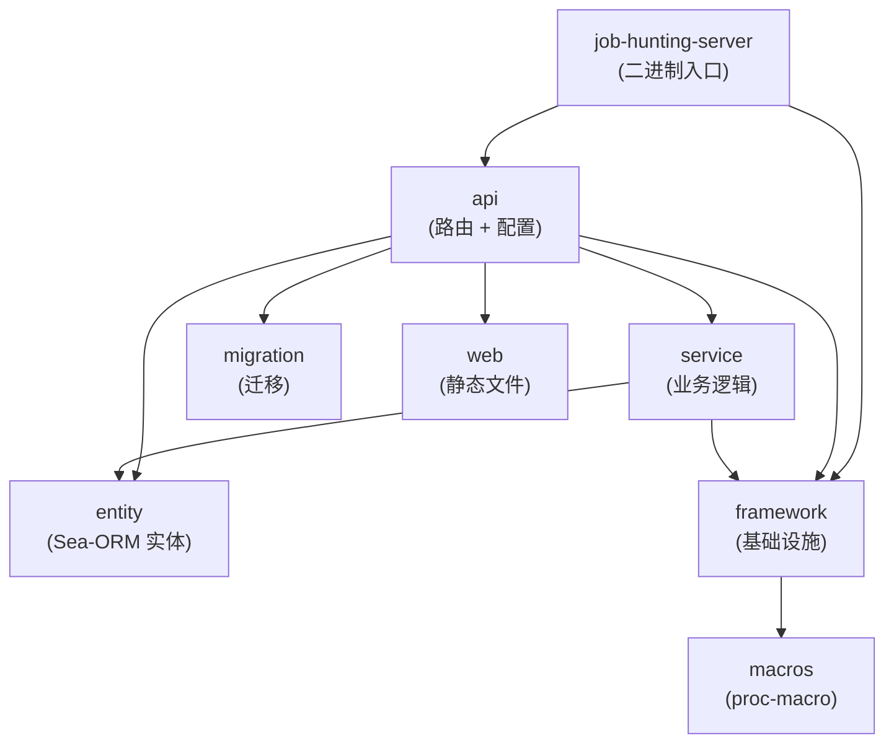
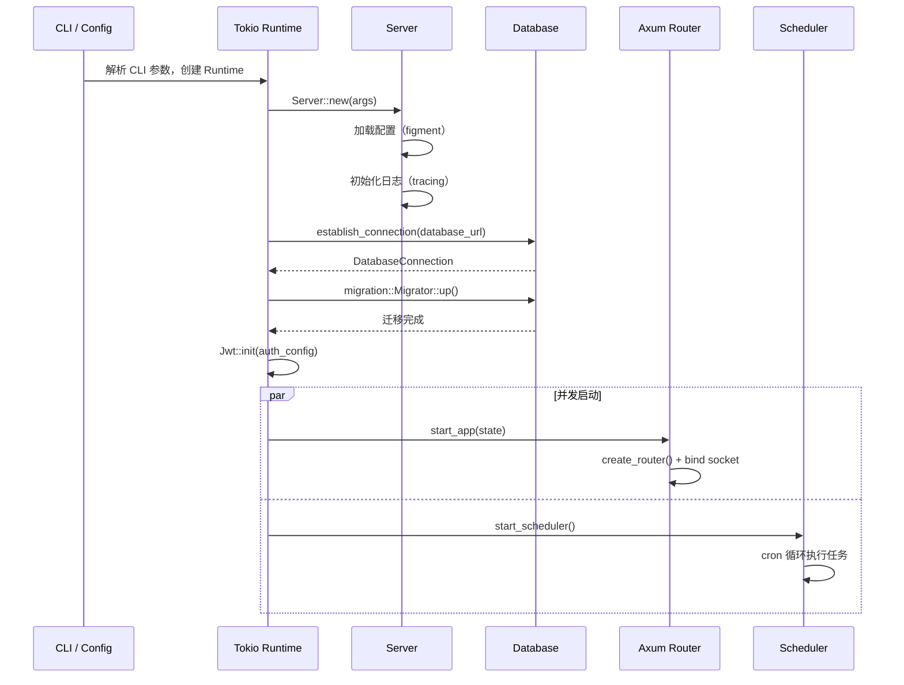

# 深入开发

## 架构概览

### Crate 依赖关系



### 启动流程



### 路由组装

所有 API 模块通过 `create_routes(state: AppState) -> OpenApiRouter` 导出路由，在 `create_router()` 中统一组装：

```rust,ignore
// api/src/lib.rs
pub fn create_router(state: AppState, ct: CancellationToken) -> Router {
    let (router, api) = OpenApiRouter::with_openapi(ApiDoc::openapi())
        // 嵌套各模块路由
        .nest("/api", job::create_routes(state.clone()))
        .nest("/api", company::create_routes(state.clone()))
        .nest("/api", auth::create_routes(state.clone()))
        // ... 更多模块
        .split_for_parts();

    router
        // Scalar API 文档
        .merge(Scalar::with_url("/docs", api))
        // 静态文件
        .route("/assets/{*file}", get(web::assets_handler))
        // SPA fallback
        .fallback(web::index_handler)
        // 全局中间件
        .layer((
            TimeoutLayer::new(Duration::from_secs(300)),
            DefaultBodyLimit::max(100 * 1024 * 1024),
            TraceLayer::new_for_http(),
            CorsLayer::permissive(),
        ))
}
```

### Handler 编写规范

每个 API handler 遵循统一模式：

```rust,ignore
// 1. 标签常量
const TAG: &str = "Company";

// 2. handler 函数
#[debug_handler]
#[utoipa::path(
    post,
    path = "/company",
    tag = TAG,
    security(("AccessToken" = [])),
    request_body = CreateCompanyParam,
    responses(
        (status = 200, description = "创建成功", body = ApiResponse<Company>),
    )
)]
async fn create(
    State(AppState { conn, .. }): State<AppState>,
    ValidJson(param): ValidJson<CreateCompanyParam>,
) -> ApiResult<ApiResponse<Company>> {
    let result = CompanyService::create(&conn, param).await?;
    Ok(ApiResponse::ok(result))
}

// 3. 路由导出
pub fn create_routes(state: AppState) -> OpenApiRouter {
    OpenApiRouter::new()
        .routes(routes!(create, update, search, detail, delete))
        .with_state(state)
}
```

关键约定：
- `#[debug_handler]` 提供编译期类型匹配错误提示
- `#[utoipa::path]` 同时生成 Axum 路由和 OpenAPI 文档
- `ValidJson<T>` / `ValidQuery<T>` 自动校验请求体/查询参数
- 响应统一用 `ApiResult<ApiResponse<T>>` 包装
- `routes!` 宏来自 `utoipa_axum`，批量注册路由

### 中间件链

全局中间件按顺序应用：

| 中间件 | 说明 |
|--------|------|
| `TimeoutLayer` | 300 秒请求超时 |
| `DefaultBodyLimit` | 100 MiB 请求体上限 |
| `TraceLayer` | tracing 日志注入 |
| `CorsLayer` | 允许所有来源跨域 |

模块级中间件：
- `JwtAuth` — 通过 `route_layer(get_auth_layer())` 添加到需要认证的路由组
- `CompressionLayer` — 对静态资源路由启用 gzip 压缩

### AppState

`AppState` 通过 Axum `State` 提取器在 handler 间共享：

```rust,ignore
pub struct AppState {
    pub conn: DatabaseConnection,
    pub auth_config: AuthConfig,
}
```

## ErrorCode 设计

### 使用教程

#### 1. 定义错误码枚举

使用 `#[error]` 宏在 `framework/src/error/` 下定义枚举，或在各业务模块中定义。

**命名规则** - 枚举名称必须以 `ErrorCode` 结尾，前缀即为模块名

| 枚举名称             | 模块名    |
| -------------------- | --------- |
| `FrameworkErrorCode` | framework |
| `UserErrorCode`      | user      |

**框架级错误码** - 定义在 `framework/src/error/` 下

```rust,ignore
#[error]
pub enum FrameworkErrorCode {
    // 3xx 框架错误: 参数校验失败、无效查询等
    ValidationInvalid = 301001,
    QueryInvalid = 301002,
}
```

**业务级错误码** - 定义在各业务模块中

```rust,ignore
#[error]
pub enum UserErrorCode {
    // 5xx 业务错误
    AccountNotFound = 503001,
    OldPasswordIncorrect = 503002,
}
```

**默认 message** - 从模块名 + 变体名自动生成（空格分隔）

| 模块名    | 变体名                 | 默认消息                       |
| --------- | ---------------------- | ------------------------------ |
| user      | `AccountNotFound`      | "user account not found"       |
| user      | `OldPasswordIncorrect` | "user old password incorrect"  |
| framework | `ValidationInvalid`    | "framework validation invalid" |

**自定义 message** - 使用宏属性

```rust,ignore
#[error]
pub enum UserErrorCode {
    #[error(message = "用户不存在")]
    AccountNotFound = 503001,
}
```

---

#### 2. 在业务代码中使用

**基本用法** - 使用 `err!` 宏自动注入调用位置

```rust,ignore
return Err(err!(UserErrorCode::AccountNotFound));
// message = "user account not found"
// 自动注入调用位置 (file:line)
```

**添加 extra_message**

```rust,ignore
// 需要在 ErrorCode 定义中添加 with_extra 方法
return Err(err!(UserErrorCode::AccountNotFound.with_extra("user_id=123")));
// message = "user account not found"
// extra_message = "user_id=123"
// 自动注入调用位置
```

**使用 ? 运算符**

```rust,ignore
let user = User::find_by_id(id).await?
    .ok_or(err!(UserErrorCode::AccountNotFound))?;
```

**使用 with_extra**

```rust,ignore
.ok_or(err!(UserErrorCode::AccountNotFound.with_extra("user_id not found")))?;
```

---

#### 3. API 响应格式

```json
{
  "code": 503001,
  "message": "account not found"
}
```

---

1. 在 `error_tests!` 宏中添加新类型：

   ```rust,ignore
   error_tests! {
       FrameworkErrorCode,
       UserErrorCode,
       CompanyErrorCode,
       JobErrorCode,
       NewErrorCode,  // 添加新类型
   }
   ```

---

### 设计原理

#### 错误码分类

| 分类   | 范围          | 说明                                   | 日志级别 | API 错误响应(StatusCode/Code/Message) |
| ------ | ------------- | -------------------------------------- | -------- | ------------------------------------- |
| 1xxyyy | 101001-199999 | 底层错误，预留                         | error    | 500/内部错误 code/内部错误            |
| 2xxyyy | 201001-299999 | 第三方错误                             | error    | 500/内部错误 code/内部错误            |
| 3xxyyy | 301001-399999 | 框架错误:如参数校验失败                | warn     | 500/内部错误 code/内部错误            |
| 4xxyyy | 401001-499999 | 关键业务错误:如多次登录错误,数据不完整 | warn     | 500/内部错误 code/内部错误            |
| 5xxyyy | 501001-599999 | 业务错误                               | info     | 400/直出/直出                         |

注意事项

- 登录错误: API 错误响应，按常规方式处理
- 参数校验失败: API 错误响应，按常规方式处理

#### 编码规则

6 位数字：`类别(1-5) + 模块(01-99) + 序号(001-999)`

#### err! 宏

使用 `err!` 宏可以自动注入调用位置（file:line）。

**原理**

- 自动注入调用位置（`file!()` + `line!()`）
- 存储在 `ApiError` 的 `file` 和 `line` 字段中

**日志输出**

```shell
[503001]account not found at src/user.rs:86
```

**使用前提**

1. 在模块中引入 prelude：

```rust,ignore
use framework::prelude::*;
```

1. 开启 DEBUG 日志级别：

```bash
RUST_LOG=DEBUG
```

> 注意：文件和行号只在 DEBUG 级别下打印
