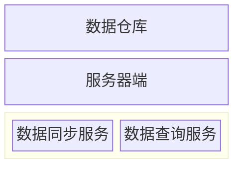

# 深入开发

> [!WIP]

## 架构



## ErrorCode 设计

### 使用教程

#### 1. 定义错误码枚举

使用 `#[error]` 宏定义错误码枚举。

**命名规则**

枚举名称必须以 `ErrorCode` 结尾，前缀即为模块名：

| 枚举名称             | 模块名    | i18n key 前缀 |
| -------------------- | --------- | ------------- |
| `FrameworkErrorCode` | framework | `framework_`  |
| `UserErrorCode`      | user      | `user_`       |
| `JobErrorCode`       | job       | `job_`        |

**框架级错误码（3xx）** - 定义在 `framework/src/error_code.rs`

```rust
#[error]
pub enum FrameworkErrorCode {
    QueryInvalid = 101001,
    JwtError = 201001,
    InternalError = 301001,
}
```

**业务级错误码（4xx）** - 定义在各业务模块中

```rust
#[error]
pub enum UserErrorCode {
    AccountNotFound = 403001,
    InvalidPassword = 403002,
}
```

**i18n key 规则**

自动生成格式：`{模块名}_{变体名_snake_case}`

例如：

- `UserErrorCode::AccountNotFound` → `user_account_not_found`
- `FrameworkErrorCode::ResourceNotFound` → `framework_resource_not_found`

> **注意**：定义新错误码后，需在 i18n 配置文件中添加对应翻译。

---

#### 2. 在业务代码中使用

**基本用法**

```rust
return Err(UserErrorCode::AccountNotFound.into());
```

**使用 ? 运算符**

```rust
let user = User::find_by_id(id).await?
    .ok_or(UserErrorCode::AccountNotFound.into())?;
```

---

**注意事项**

添加新的 ErrorCode 模块时，必须同步修改单元测试 `api/tests/error_code_tests.rs`：

1. 在 `error_tests!` 宏中添加新类型：

   ```rust
   error_tests! {
       FrameworkErrorCode,
       UserErrorCode,
       CompanyErrorCode,
       JobErrorCode,
       NewErrorCode,  // 添加新类型
   }
   ```

2. 创建对应的 i18n 文件：`i18n/locales/{locale}/{module}.json`

3. JSON keys 必须与 ErrorCode 变体名匹配（snake_case）

---

### 设计原理

#### 错误码分类

| 分类 | 范围          | 说明       |
| ---- | ------------- | ---------- |
| 1xx  | 101001-199999 | 标准错误   |
| 2xx  | 201001-299999 | 第三方错误 |
| 3xx  | 301001-399999 | 框架错误   |
| 4xx  | 401001-499999 | 业务错误   |

#### 编码规则

6 位数字：`类别(1-4) + 模块(01-99) + 序号(001-999)`

例如：`403001` = 4(业务错误) + 03(user 模块) + 001(第 1 个错误)

#### 核心组件

- `framework/macros/src/lib.rs`: `#[error]` proc-macro 实现
- `framework/src/error_code.rs`: FrameworkErrorCode 定义
- `framework/src/error.rs`: ApiError 和 AppErrorCode trait
