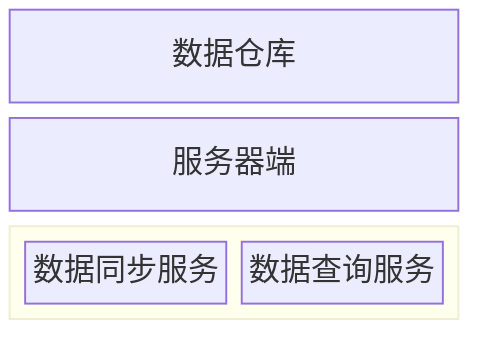

# 深入开发

> [!WIP]

## 架构



## ErrorCode 设计

### 使用教程

#### 1. 定义错误码枚举

使用 `#[error]` 宏在 `framework/src/error/` 下定义枚举，或在各业务模块中定义。

**命名规则** - 枚举名称必须以 `ErrorCode` 结尾，前缀即为模块名

| 枚举名称             | 模块名    | i18n key 前缀 |
| -------------------- | --------- | ------------- |
| `FrameworkErrorCode` | framework | `framework_`  |
| `UserErrorCode`      | user      | `user_`       |

**框架级错误码** - 定义在 `framework/src/error/` 下

```rust,ignore
#[error]
pub enum FrameworkErrorCode {
    // 3xx 框架错误: 参数校验失败、无效查询等
    ValidationInvalid,
    QueryInvalid,
}
```

**业务级错误码** - 定义在各业务模块中

```rust,ignore
#[error]
pub enum UserErrorCode {
    // 5xx 业务错误
    AccountNotFound,
}
```

> **注意**：定义新错误码后，需在 i18n 配置文件中添加对应翻译（key 格式：`{模块名}_{变体名_snake_case}`）

---

#### 2. 在业务代码中使用

**基本用法**

```rust,ignore
return Err(UserErrorCode::AccountNotFound.into());
```

**使用 ? 运算符**

```rust,ignore
let user = User::find_by_id(id).await?
    .ok_or(UserErrorCode::AccountNotFound.into())?;
```

---

**注意事项**

添加新的 ErrorCode 模块时，必须同步修改单元测试 `api/tests/error_code_tests.rs`：

1. 在 `error_tests!` 宏中添加新类型：

   ```rust,ignore
   error_tests! {
       FrameworkErrorCode,
       UserErrorCode,
       CompanyErrorCode,
       JobErrorCode,
       NewErrorCode,  // 添加新类型
   }
   ```

2. 创建对应的 i18n 文件：`i18n/locales/{locale}/{module}.json`

3. JSON keys 必须与 ErrorCode 变体名匹配（snake_case）

---

### 设计原理

#### 错误码分类

| 分类   | 范围          | 说明                                   | 日志级别 | 堆栈日志 | API 错误响应(StatusCode/Code/Message) |
| ------ | ------------- | -------------------------------------- | -------- | -------- | ------------------------------------- |
| 1xxyyy | 101001-199999 | 底层错误，预留                         | error    | 是       | 500/内部错误 code/内部错误            |
| 2xxyyy | 201001-299999 | 第三方错误                             | error    | 是       | 500/内部错误 code/内部错误            |
| 3xxyyy | 301001-399999 | 框架错误:如参数校验失败                | warn     | 否       | 500/内部错误 code/内部错误            |
| 4xxyyy | 401001-499999 | 关键业务错误:如多次登录错误,数据不完整 | warn     | 否       | 500/内部错误 code/内部错误            |
| 5xxyyy | 501001-599999 | 业务错误                               | info     | 否       | 400/直出/直出                         |

注意事项

- 登录错误: API 错误响应，按常规方式处理
- 参数校验失败: API 错误响应，按常规方式处理

#### 编码规则

6 位数字：`类别(1-5) + 模块(01-99) + 序号(001-999)`
