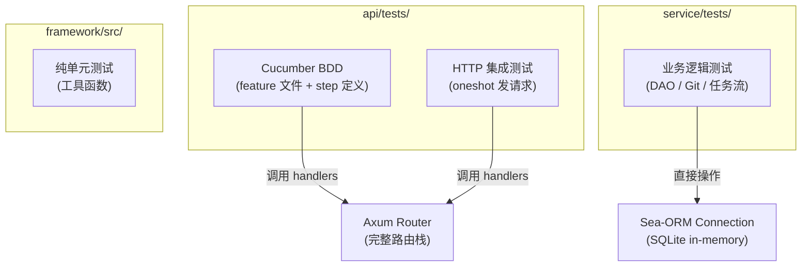

# 测试

## 测试架构

测试分布在三个 crate 中，按层次划分：

| Crate | 测试类型 | 工具 | 位置 |
|-------|---------|------|------|
| `framework` | 纯单元测试 | `#[cfg(test)]` 内联 | `src/*.rs` |
| `service` | 业务逻辑集成测试 | testcontainers + SQLite | `service/tests/` |
| `api` | API BDD 测试 + 接口集成测试 | cucumber + tower::oneshot | `api/tests/` |



## Cucumber BDD 测试

BDD 测试是 API 层的主要测试方式，使用 [cucumber](https://crates.io/crates/cucumber) crate。

### 目录结构

```text
api/tests/
├── common/
│   └── mod.rs              # 测试辅助函数：HTTP 客户端、DB 初始化
├── features/               # Gherkin 场景文件
│   ├── auth/auth.feature
│   ├── company/company.feature
│   └── job/get_info/search.feature
├── feature_auth_test.rs    # Auth step 定义
├── feature_company_test.rs # Company step 定义
├── feature_job_test.rs     # Job search step 定义
├── company_test.rs         # 纯单元测试（CSV 转换）
└── index_test.rs           # 冒烟测试
```

### World 结构体

每个 feature 文件对应一个 `World` 结构体，实现 `cucumber::World` trait：

```rust,ignore
#[derive(Debug, Default, cucumber::World)]
struct TestWorld {
    // 数据库连接
    conn: Option<DatabaseConnection>,
    // 当前登录用户的 token
    access_token: Option<String>,
    // 某场景下的状态（如创建的公司 ID）
    company_id: Option<String>,
    // ...
}
```

### Feature 文件示例

```gherkin
Feature: Company CRUD
  Background:
    Given insert tables

  Scenario: Create company
    Given access_token without token
    When I create the #companyName company
    Then I should see company created

  Scenario: Search companies
    Given access_token without token
    And company #companyName created
    When I search companies without params
    Then I should see company #companyName in the search results
```

### Step 定义示例

```rust,ignore
#[given(expr = "access_token {word} token")]
async fn setup_token(world: &mut TestWorld, token_type: String) {
    // 根据 token_type 设置 world.access_token
    match token_type.as_str() {
        "without" => world.access_token = None,
        "with" => {
            // 登录获取 token
            let result = login(&world.conn, "root", "root").await;
            world.access_token = Some(result.access_token);
        }
        _ => unreachable!(),
    }
}

#[when(expr = "I create the {string} company")]
async fn create_company(world: &mut TestWorld, name: String) {
    use common::post_json_with_token;

    let resp = post_json_with_token(
        &world.app, "/api/company", &create_params(&name), world.access_token.as_deref()
    ).await;
    let body = common::response_to_json(resp).await;
    world.company_id = Some(common::get_from_value(&body, "data.id"));
}

#[then(expr = "I should see company {string} in the search results")]
async fn check_company_in_results(world: &mut TestWorld, name: String) {
    let resp = get_json_with_token(
        &world.app, "/api/company/search?name={name}", world.access_token.as_deref()
    ).await;
    let body = common::response_to_json(resp).await;
    let items = common::get_json_paging_result_items(&body);
    assert!(items.iter().any(|i| i["name"] == name));
}
```

### 场景执行入口

每个 BDD 测试文件有一个 `#[tokio::test]` 入口：

```rust,ignore
#[tokio::test]
async fn main() {
    TestWorld::cucumber()
        .before(|_feature, _rule, _scenario, world| {
            // 每个场景前执行：初始化数据库、组装 Router
            Box::pin(async {
                let (container, conn) = common::setup_database().await;
                world.conn = Some(conn.clone());
                world.app = Some(create_test_router(conn).await);
                world.container = container;
            })
        })
        .after(|_feature, _rule, _scenario, world| {
            // 每个场景后执行：清理数据库
            Box::pin(async {
                common::tear_down(world.container.take()).await;
            })
        })
        .run("tests/features/company/company.feature")
        .await;
}
```

### 运行 BDD 测试

```bash
# 运行所有 API 测试（含 BDD 和集成测试）
cargo test --package job-hunting-server

# 仅运行 API crate 的测试
moon run server:test
```

## 数据库：测试隔离

每个测试场景获得**独立的 SQLite in-memory 数据库**，通过 `setup_database()` 创建：

```rust,ignore
pub async fn setup_database() -> (Option<ContainerAsync<Postgres>>, DatabaseConnection) {
    // 当前使用 SQLite in-memory（快速、隔离）
    let container = None;
    let conn = framework::database::establish_connection("sqlite::memory:")
        .await
        .unwrap();
    // 运行全部迁移
    migration::Migrator::up(&conn, None).await.unwrap();
    (container, conn)
}
```

> 设计预留了切换到 PostgreSQL 的能力：取消注释 testcontainers 部分即可，`Option<ContainerAsync<Postgres>>` 保证了兼容。

## 测试辅助工具

`api/tests/common/mod.rs` 提供了一套 HTTP 测试工具函数，通过 `tower::ServiceExt::oneshot` 直接向 Axum Router 发请求（不走 TCP 网络）：

| 函数 | 说明 |
|------|------|
| `setup_database()` | 初始化 SQLite 内存库 + 运行迁移 |
| `tear_down()` | 如需则停止 testcontainers 容器 |
| `response_to_json()` | `Response<Body>` → `serde_json::Value` |
| `get_json_result()` | 从 API 响应中提取 `data` 字段 |
| `get_json_paging_result_items()` | 从分页响应中提取 `data.items` |
| `get_from_value()` | 从 JSON Value 中按类型提取字段 |
| `post_json()` | POST JSON body |
| `post_json_with_token()` | POST JSON body + Bearer token |
| `get_json()` / `get_json_with_token()` | GET + 可选 token |
| `put_json()` / `put_json_with_token()` | PUT + 可选 token |
| `delete_json()` / `delete_json_with_token()` | DELETE + 可选 token |

## 服务层测试

`service/tests/` 下的测试直接操作 Sea-ORM 连接和业务逻辑：

- **`dao_test.rs`**: 实体 CRUD、分页查询
- **`file_parser_test.rs`**: Excel 文件解析、表头校验
- **`import_job_test.rs`**: 从 Excel 行导入职位数据
- **`import_company_test.rs`**: 从 Excel 行导入公司数据
- **`task_test.rs`**: 完整的下载+合并任务流程
- **`scheduler_test.rs`**: 任务计划调度 + 任务队列消费
- **`git_test.rs` / `git_lite_test.rs`**: Git 操作（需 Gitea testcontainers）

服务层测试也提供了一套公共工具（`service/tests/common/mod.rs`），包括：
- `setup_gitea_with_test_data()` — 启动 Gitea 容器并推送测试 fixture 数据
- `create_test_file_map()` — 映射测试资源文件

## 测试用 Fixture 数据

```text
service/tests/resources/data/
├── job-v0.zip / job-v1.zip         # 职位数据
├── company-v0.zip / company-v1.zip / company-v2.zip  # 公司数据
├── job-v1.xlsx                     # 职位 Excel
└── company-v2.xlsx                 # 公司 Excel
```

## 新增测试场景

### 新增 API BDD 场景

1. 在 `features/` 对应子目录下编写 `.feature` 文件
2. 在 `feature_*_test.rs` 中添加 `#[given]` / `#[when]` / `#[then]` step 定义
3. 在 step 定义中使用 `common::*` 工具函数发送 HTTP 请求、提取响应

### 新增服务层测试

1. 在 `service/tests/` 下新建 `_test.rs` 文件
2. 使用 `common::setup_database()` 初始化数据库
3. 直接调用 `service` crate 中的函数并断言结果
